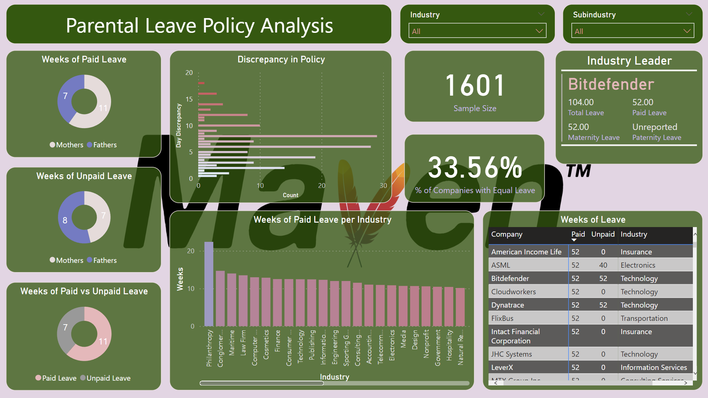

# Analysis of Parental Leave Policy in 1600 Companies

This project is for the [Maven Family Leave Challenge](https://mavenanalytics.io/blog/maven-family-leave-challenge?utm_source=linkedin&utm_campaign=mavenfamilyleavechallenge_li_maven). The goal is to analyze the parental leave policies of 1600 companies and determine which companies have the best policies. It is important to note that the dataset contains self-reported data, so it is not necessarily accurate, and there is little information within the dataset about how the policies are implemented. Further, the dataset has very little data on paternity leave, so the analysis can be heavily skewed if the datapoints are not representative of the population.

## Data

The data is in the form of a CSV file, and the columns are as follows:

* **Company**: Company name.
* **Industry**: Company industry & sub-industry.
* **Paid Maternity Leave**: Paid weeks off from work for mothers after the birth of their child.
* **Unpaid Maternity Leave**: Unpaid weeks off from work for mothers.
* **Paid Paternity Leave**: Paid weeks off from work for fathers.
* **Unpaid Paternity Leave**: Unpaid weeks off from work for fathers.

We clean the dataset and append the following columns:

* **Average Paid Leave**: Average paid weeks off from work for both mothers and fathers.
* **Average Unpaid Leave**: Average unpaid weeks off from work for both mothers and fathers.
* **Total Leave**: Total weeks off from work for both mothers and fathers.
* **Paid Leave Percentage**: Percentage of total leave that is paid.
* **Gender Discrepancy**: Difference between total paid leave for mothers and fathers.

## Results

The results of the analysis are as follows:

* We find that around 33% of companies have the same leave policy for both mothers and fathers.

* Mothers on average get 60% more paid leave than fathers.

* Fathers and mothers both get around the same amount of unpaid leave.

* Companies offer 60% more paid leave than unpaid leave.

* The average paid leave is 11 weeks, the average unpaid leave is 7 weeks, and the total leave is 9 weeks.

* The industry with the most paid leave is **Philanthropy**, with an average of 22 weeks, followed by **Law Firms** at 14. Philanthropy also boasted a discrepancy of 0, meaning that the paid leave for both mothers and fathers was the same for every company in the industry represented in the dataset.

* The company with the **most leave** are Bitdefender and Dynatrace, with a total of 52 paid weeks off and 52 unpaid weeks off. No company in the dataset offers more than 52 weeks of paid leave.

* 53 companies offered no paid leave, and 532 companies offered no unpaid leave. Of these, only 7 companies offered no leave at all.
